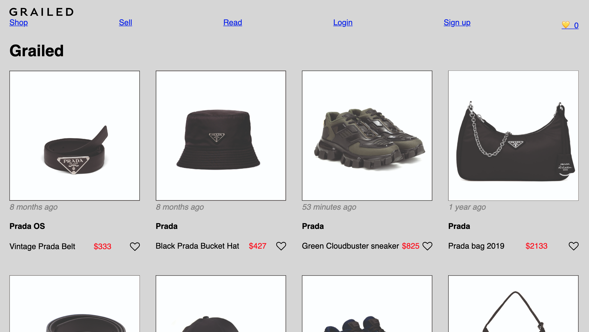
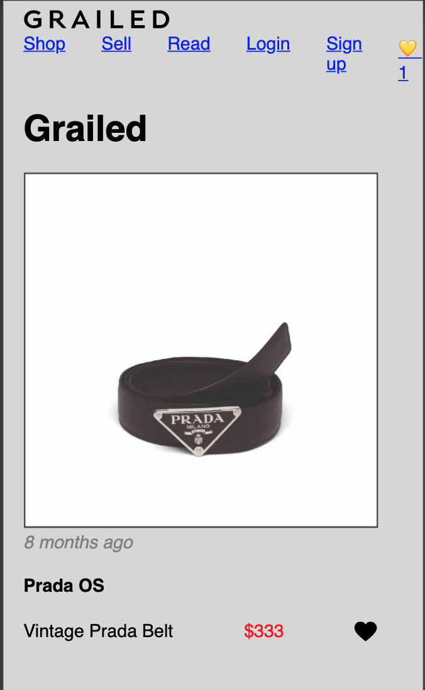
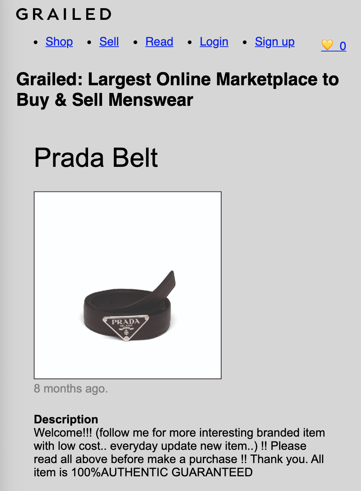
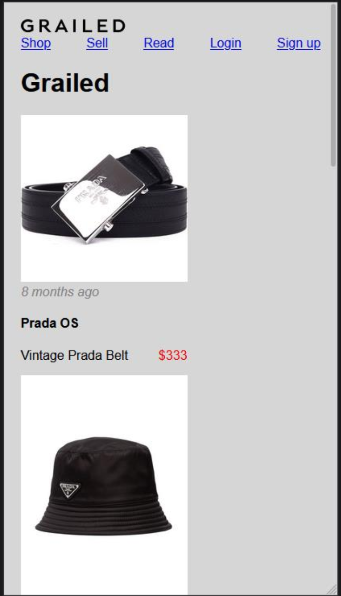
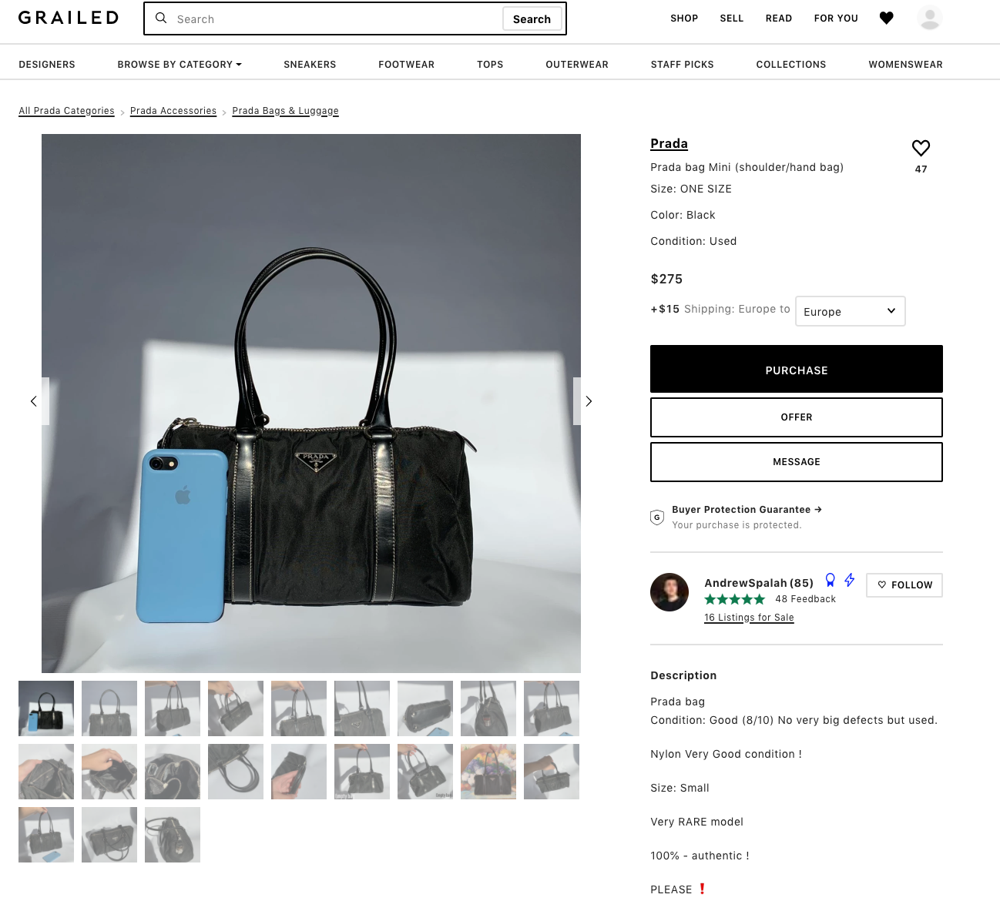
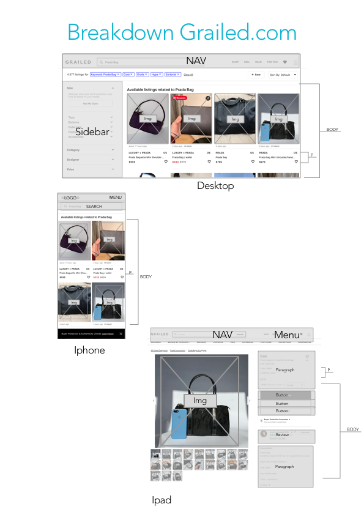

# Procesverslag
**Auteur:** Daniël Linger

Markdown cheat cheet: [Hulp bij het schrijven van Markdown](https://github.com/adam-p/markdown-here/wiki/Markdown-Cheatsheet). Nb. de standaardstructuur en de spartaanse opmaak zijn helemaal prima. Het gaat om de inhoud van je procesverslag. Besteedt de tijd voor pracht en praal aan je website.

## Bronnenlijst
1. Sanne van 't hooft - Hartjes Javascript
2. Stackoverflow
3. w3schools.

## Eindgesprek (week 7/8)

-dit ging goed & dit was lastig-

Ik heb mij goed voorbereid op het eindgesprek. Ik weet dat het geen perfect werk is, maar ik ben wel trots op hoe ik gewerkt heb. Ik ben van mening dat ik als bleek er in ben gestapt en dat ik in iedergeval wel de uitdaging ben aangegaan. Ik begon het op een gegeven moment door te krijgen en ik begon het zelfs leuk te vinden. Wie had dat gedacht?
Ik ben dankbaar voor alle tips en tricks die ik van mede studenten en ook student assistenten mee heb gekregen. 

Wat ging er goed:

- alles is responsive en dat was het eindgoal
- de javascript is goed toegepast
- de website lijk voor een groot gedeelte op de 
  orignele website.
-  De motivatie had ik weer terug gevonden

Wat ging er minder goed:
-  Ik wilde meer functies toevoegen zoals een carrousel voor de afbeeldingen alleen dat lukte niet waardoor het wel een bepaalde look & feel mist.

-screenshot(s) van je eindresultaat-

## Voortgang 3 (week 6)

Ik had in die week een grote tegenslag. Mijn oom was overleden in die week waardoor ik mij niet goed kon focussen op de opdracht. Mijn ouders zeiden mij dat het misschien wel voor afleiding zou zorgen om te gaan coderen. Het heeft inderdaad geholpen om afleiding te zoeken. Ik ben na een les met Sanne 2 uur lang gaan zitten om naar mijn code te kijken. Sanne heeft mij heel erg geholpen met het uitleggen van codes en het leren begrijpen. Hij was heel eerlijk en gaf mij het vertrouwen om door te gaan. Het heeft ervoor gezorgd dat ik ook uiteindelijk alles heb kunnen maken wat er van mij gevraagd werd. Hier door kon ik Javascript toepassen. Hij had een codepen met hartjes uitgewerkt en die heb ik goed kunnen toevoegen aan mijn website.

Wat ging er goed:

Ik had weer motivatie om het eindproduct te voltooien
Ik snapte de werking vaan javascript met Sanne's uitleg
Ik snapte de werking van styling waardoor de focus responsiveness beter naar voren kwam.

Wat ging er minder goed
Ik merkte dat dat ik soms traag van begrip was bij Sanne's uitleg en dat maakte mij soms onzeker
Ik had bij sommige onderdelen meer begeleiding nodig dan ik eigenlijk had gedacht.

## Voortgang 2 (week 5)

Tijdens mijn voortgang liep ik een klein beetje achter. Het idee was er wel alleen de uitwerking ervan was nog niet optimaal. Het was nog niet responsive genoeg waardoor ik eigenlijk de focus niet had behaald. Ik had het er moeilijk mee waardoor ik ook minder gemotiveerd was om het op te leveren. Ik kreeg van Arsen de feedback dat ik door moest zetten en dat we het zouden gaan laten lukken. 

Wat ging er goed:
Ik had iniedergeval de mentaliteit om het te laten lukken

Wat ging er minder goed
 Ik zag door de bomen het bos niet meer ( andere vakken , teveel , stress.)
 De website was totaal nog niet responsive.

## Meeting met Marvin  Sernee ( studentassistent)

Tijdens de meeting die ik had met Marvin had ik voorbereid om te leren om nette code te schrijven. Hij gaf mij al snel als tip mee om semantisch en correct te werk te gaan. Hij zag dat ik er moeite mee had en gaf steeds goede voorbeelden zodat ik het zelf kon leren. Het fijne was dat hij mij hielp door vragen te stellen. Zo leerde ik het beter waardoor ik beter toe kon werken naar mijn eindoplevering.

## Voortgang 1 (week 3)

Ik heb tijdens de les mijn eerste opzet laten zien. Ik kreeg positieve feedback. Ik had de look en feel van de echt website goed over kunnen brengen waardoor de docent en de klasgenoten mijn opdrachten goed begreep. Ik vond het wel moeilijk om de oefeningen uit te les te realiseren in mijn concept. Het ging er met name om dat ik soms vastloop als ik code moet schijven.

Wat ging er goed:

De opdracht uitwerken verliep goed

Wat ging er minder goed:

- Ik liep vast met flexbox toetepassen op correcte wijzen
- Ik liep vast met het positioneren van elementen.

### Stand van zaken

Dit ging goed:
- Het idee verder uitwerken na het gesprek ging goed
- Ik begreep de froggyflexbox
- classes geven aan items begreep ik weer

Wat ging minder goed:
-   Ik vond het lastig om afbeeldingen te stijlen
-   Responsiveness tot leven te laten komen
-   Alles zelf doen is lastig omdat ik merk dat als  ik een zetje in de rug krijg, het later beter gaat.

**Screenshot(s):**

-screenshot(s) van hoe ver je bent-

### Agenda voor meeting

- Idee pitchen
- Flexbox of grid
- Responsivess
- Javascrpit

### Verslag van meeting met Vasilis

Tijdens de eerste week heb ik het idee gepitched bij Vasilis. Ik had aangegeven dat programmeren niet mijn passie is en dat ik duidelijk op de rode piste zit. Ik wilde voor een goed lopende website gaan die een idicatie geeft van de echt website.

Het gesprek ging goed er was werk aan de winkel maar ik had er enorm zin in. De codepen les sloot goed aan om een begin te maken aan de website.

## Intake (week 1)

*Grailed: Vintage High-End

Proces Verslag Frontend Development:

Startniveau: Middelmatig, kan basis code, weinig verstand van javascript.

Namaak Website: www.grailed.com Reden: Ik maak veel gebruik van deze website ,het is een high-end vintage doorverkoop medium. Veel functies worden responsive gemaakt binnen de site. O.A: - Liken - Subscriben - Saven - Recommend choices

Focus ligt op: - Saved Items - Followed Sellers

**Breakdown-schets(en):**

